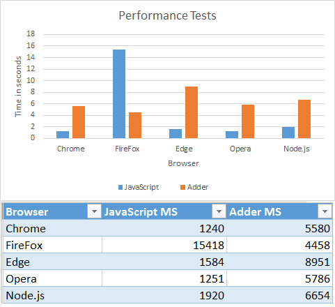

- [Official Site](http://adderscript.com/)

- [Official Docs](http://adderscript.com/docs.html)

- [Online Sandbox](http://adderscript.com/examples/sandbox.html)

# AdderScript

Executing untrusted code with ease.

## What is it

Adder is a lightweight python-like language, implemented on top of JavaScript and designed to be safe to execute untrusted code.

### Why?

The main purpose of Adder is to let you execute untrusted code on other users's browsers and even on your Node.js server, without worrying about security complications.

Adder will not let the untrusted code access anything you don't want it to access, will not allow it to get stuck or hog resources, and will make sure it can't do any harm or go outside its boundaries.

The main reason Adder is secured is that *no JavaScript code is ever executed using plain eval()*.
Instead, everything is parsed and interpreted by the Adder interpreter, that is built and designed to be limited and safe.

## Advantages

Here are the key features of Adder:

- Beautiful Pythonic syntax - if you know Python, you know Adder.
- Secured by design (Adder is designed to run untrusted code).
- Works on both Node.js and Browsers.
- No need for any sub-processes.
- Simple & accessible interface.
- Easy to extend, and easy to remove builtins and limit.
- Agnostic to JavaScript changes and versions.
- Easy to limit memory usage, commands per run, execution time, etc..
- Caching and Optimizations makes it pretty fast for multiple executions.

## Platforms

Adder works and heavily tested on the following browsers / platforms:

- Chrome 53
- IE Edge
- FireFox 45
- Opera 40
- Node.js 4.1.1


## Install

There are several ways to install Adder:

#### Via npm

```
npm install adder-script
```

#### Via bower

```
bower install adder-script
```

#### Via git (clone)

```
git clone https://github.com/RonenNess/adder.git
```

Or you can download from the [GitHub repository](https://github.com/RonenNess/adder).

#### Building The Code

To build the distributed version for client side, run the command `build.bat`.
It uses `browserify` and `uglifyjs`, so be sure to install them first.

## Tests & Examples

### Tests

To run Adder tests, you can open the html file *tests/test.html* in the browser of your choice.

To test in Node.js, run the following command (requires *Node.js* and *qunit-cli* installed):

```
qunit-cli tests/test.js
```

### Performance Tests

To run performance tests, open the html file *tests/performance.html* in the browser of your choice.
To test performance in Node.js, execute file *tests/performance-node.js* in Node.

Note that results may vary from run to run, so its recommended to execute several times and do an average.

### Interactive Shell

To get an interactive shell and play with the language, you can open *examples/shell.html* in the browser of your choice.

### Sandbox

To get a rich Adder sandbox with code examples and minimal editor, you can open *examples/sandbox.html* in the browser of your choice.

## Performance

In overall, Adder appears to be 3-5 times slower than executing plain JavaScript, **on multiple executions**. On FireFox it appears to be much faster, due to caching of expressions.

The following is a summary of performance tests I conducted on multiple browsers (with windows 8). In bars below less is better:




These tests execute the same logic with Adder and JavaScript couple thousands of times, and measure the time it took to execute each code.

Please note:

- The tests above don't include compile time (Adder scripts are compiled prior the tests).
- Adder programs that execute multiple times have internal caching which makes them faster. If your project run each Adder program only once, performance would be slightly worse.

For more info check out *tests/performance.html*.

___

# Executing Adder - Host application side

This part of the docs explain how to setup and execute Adder from the host application side, eg the client JavaScript or your Node.js server.

Later in these docs we'll learn the language itself and how to write Adder scripts.


## Quick Example

Before diving into the APIs, lets start with a simple example:

```JavaScript
// init Adder environment (connect output to alerts)
AdderScript.init({
    outputFunc: function(text) {alert("output from script: " + text);},
});

// create a simple script and compile it
compiledCode = AdderScript.compile('print("Hello World!")');

// spawn a program and execute it
// the result will be an alert with the text "Hello World!".
var program = AdderScript.newProgram(compiledCode);
program.execute();
```

Pretty simple right? Now lets dive in a little deeper.

## Init Environment

To run Adder scripts you first need to init environment:

```JavaScript
// if you don't provide any params output will go to console.log and default flags will apply
AdderScript.init();
```

## Compile Code

Once the environment is ready, you can compile Adder codes using the compile function:

```JavaScript
var compiled = AdderScript.compile(someCodeString);
```

## Save / Load pre-compiled code

If you want to save the compiled code for later usage, you can simply JSON.stringify() it into a file:

```JavaScript
// require fs
var fs = require('fs');

// save compiled code:
fs.writeFile(filename, JSON.stringify(compiledCode), function(err) {
    // handle errors...
});

// load compiled code you previously saved
fs.readFile(filename, 'utf8', function(err, data) {
    if (err) // handle errors...
    compiledCode = JSON.parse(data);
});
```

## Create & Execute Programs

An Adder ```Program``` can be think of as a process executing a single Adder script one or more times.
However, the Adder ```program``` is not a real process but an object living on the same memory space as the host application.

To spawn a new program from a compiled code, use ```newProgram()```:

```JavaScript
var program = AdderScript.newProgram(compiledCode);
```

The program will now live in memory and you can execute it as many times as needed and access its internal memory and variables.

Executing the same program multiple times is much faster than spawning a new program every time, due to caching and internal optimizations.
In addition, global scope variables will stay alive between different executions of the same program.

To execute the program code once, use execute:

```JavaScript
program.execute();
```

If you want to clear your program's context (eg remove all user defined variables from global scope), use ```resetContext()```:

```JavaScript
program.resetContext();
```

## Get values and execution errors

You can easily access the last evaluated result and get it as a native JavaScript object, using ```getLastValue()```:

```JavaScript
var lastVal = program.getLastValue();
```

In addition, you can read any variable in the program's global scope using ```getGlobalVar()```:

```JavaScript
// get variable from global scope as native javascript object
var value = program.getGlobalVar("var_name");
```

Or, you can set any variable in the program's global scope using ```setGlobalVar()```:

```JavaScript
// set variable in program global scope
program.setGlobalVar("var_name", value, isReadonly);
```

In addition, you can check if any error occurred during the last execution, using ```getLastError()```:

```JavaScript
var lastError = program.getLastError();
if (lastError) {
    console.log(lastError.message);
}
```

You can see all Adder error types in object ```AdderScript.Errors```, or in file *errors.js*.

## Advanced init settings

When init Adder environment you can provide a dictionary with the following settings:

```JavaScript
AdderScript.init({
    flags: {},                  // different compiler / interpreter flags you can set (explained later).
    modules: ["ALL"],           // which modules to load. ['ALL'] will load all built-in modules.
    outputFunc: printOutput,    // function to handle scripts output, when print() is called.
    showDebugConsole: true,     // if true, Adder will dump some extra debug data to console.
});
```

### flags

The following are all the flags you can set when you init Adder environment (as the 'flags' option):

```JavaScript
var flags = {
    stackLimit: 256,                // Stack depth limit. If exceeded will throw 'StackOverflow' exception.
    maxStatementsPerRun: 2048,      // Maximum statements that can be executed in a single run. If exceeded will throw 'ExceededStatementsLimit' exception.
    maxStringLen: 5000,             // Maximum allowed string lengths. If exceeded will throw 'ExceedMemoryLimit' exception.
    maxContainersLen: 1000,         // Maximum values allowed in lists, sets and dictionaries. If exceeded will throw 'ExceedMemoryLimit' exception.
    maxVarsInScope: 100,            // Limit number of variables allowed per scope. If exceeded will throw 'ExceedMemoryLimit' exception.
    executionTimeLimit: 1000,       // Time limit for a single execution (in milliseconds). If exceeded will throw 'ExceededTimeLimit' exception.
    memoryAllocationLimit: 10000,   // Memory limit, very roughly estimated, in bytes (per execution). If exceeded will throw 'ExceedMemoryLimit' exception.
    removeBuiltins: [],             // An optional list of builtin function and const names you want to remove from the language.
    throwErrors: false,             // If true, will throw exceptions from Adder execution if occur. If false, you need to check errors with getLastError().
}
```

### modules

Modules are objects with functions and consts you can access from Adder scripts.
For example, there's the built-in *Math* module that provide all the Math-related functionality and consts.

You can choose which modules are included in your environment to have fine control over which APIs Adder scripts can access.

Note that you cannot import modules from inside Adder script, Adder code can only access what the host application allows it (this is by design).

To include all modules you can set ```modules``` to ```["ALL"]```.
However, that's not recommended in production, as it will include modules that can pop alerts and write to console (something you normally wouldn't want). 

To load only the "safe for production" modules, use ```["SAFE"]```.

All available modules will be described later in the chapter about writing Adder scripts.

### outputFunc

An optional function to handle script output when ```print``` is called. For example, if you want to send all ```print``` output directly to console:

```JavaScript
function outputFunc() {
    console.log(Array.from(arguments).join(" "));
}
```

Note that this is the default behavior; If no outputFunc is provided, all output will go to console.log by default.

### showDebugConsole

If set to true, Adder will show some useful debug data in console.

## Register Functions

The most simple way to extend Adder's API and create an interface to the host application, is via builtin functions.

Builtin functions are basically functions Adder scripts can call from anywhere (defined in global scope) and will execute hard-coded JavaScript code.

To register a new builtin function use ```addBuiltinFunction()```:

```JavaScript
// init AdderScript environment
AdderScript.init();

// add builtin function
AdderScript.addBuiltinFunction({name: "test",                   // function name
                                func: function(x) {alert(x)},   // the function itself
                                requiredParams: 1,              // number of required params
                                optionalParams: 0});            // number of additional optional params
```

The code above will add a builtin function called 'test', that gets one parameter and alert it.

Once registered, you can use the new function like any other built-in Adder function (the following is an Adder script code):

```Python
# will alert "Hello World!"
test("Hello World!")
```

### Return Complex Objects

If you want your function to return a dictionary or a complex object, and not just a basic type, you need to use ```toAdderObject``` on the returned value. For example:

```JavaScript
// the actual function implementation
function testFunc(x) {
	AdderScript.toAdderObject("testFuncReturnType", 
	{
		foo: 5,
		bar: 10,
	}, this);
}

// add builtin function
AdderScript.addBuiltinFunction({name: "test",                   // function name
                                func: testFunc,   				// the function itself
                                requiredParams: 1,              // number of required params
                                optionalParams: 0});            // number of additional optional params
```

Then it can be used from Adder like this:

```Python
ret = test()
if ret.foo == 5:
    print("Success!")
```

## Register A Custom Module

Just like registering a builtin function, you can register a custom module to Adder's API.

As mentioned before, a module is an object containing functions and constants wrapped together under one object.

To define a custom built-in module:

```JavaScript
// init AdderScript environment
AdderScript.init();

// add builtin module
AdderScript.addBuiltinModule("Test",
                                  {
                                    // define a function named 'foo'
                                    "foo": {
                                        func: function(x) {alert(x)},
                                        requiredParams: 1,
                                        optionalParams: 0
                                     },

                                     // define a const named 'bar' that equals to "World"
                                     "bar": "World",
                                  }
                              );
```

The code above will define a module named ```Test``` with a function ```foo()``` and a constant string ```bar```.

Once defined, you can use the new module just like any other built-in module (the following is an Adder script code):

```Python
# will alert "Hello World!" (Test.bar equals to "World")
Test.foo("Hello " + Test.bar + "!")
```


## Define an enum

To create an enum you can add a custom module with nothing but consts in it. For example:


```JavaScript
// add an enum
AdderScript.addBuiltinModule("Colors",
                                  {
                                    "Red": 0,
									"Blue": 1,
									"Green": 2,
									"Yellow": 3,
                                  }
                              );
```

Then from code users can access it as:

```Python
color = Colors.Red
```


## Define a built-in object type

A module acts like a singleton. But what if you need an object you can instantiate, like Adder's ```list```, ```dict``` or ```set```?

To define a new built-in object type use ```defineBuiltinObject()```:

```JavaScript
// init AdderScript environment
AdderScript.init();

// define a new object type "Person" and return a function to instantiate it
createPerson = AdderScript.defineBuiltinObject("Person", {
                                    "say_hello": {
                                        func: function() {alert("Hello World!")},
                                        requiredParams: 0,
                                        optionalParams: 0
                                     },
                                     "race": "human",
                                  });

// now you can use 'createPerson' to create a new 'Person' instances.
// however, you still need to provide an API for Adder to create it.
// lets register a new built-in function, "create_person", that will use 'createPerson' to create a new 'Person' instance:
AdderScript.addBuiltinFunction({name: "create_person",                          // function name
                                func: function(x) {return createFunc(this)},    // the function itself to create Person.
                                requiredParams: 0,              // number of required params
                                optionalParams: 0});            // number of additional optional params
```

Note that 'createPerson' function expect to get 'this' as param, where 'this' is any built-in function or module.

Now you can create and use the new 'Person' objects from Adder scripts (the following is an Adder script code):

```Python
# will create a new person and call its function 'say_hello()'
a = create_person()
a.say_hello()
```

___


# Writing Adder Scripts

Previously we learned how to execute adder scripts and interact with them from the host application side.
In this part of the tutorial we'll learn how to actually write Adder scripts.

## Basic Syntax

Adder syntax is the same as [Python](https://www.python.org), so if you know Python you know Adder and can skip this part.

If you are not familiar with Python, here's a quick summary (after this you will also be able to use Python!).

### Indentation

Adder is indent-sensitive; indentation is used to open and close blocks (instead of curly brackets in other languages).

Lets take a look at an example with ```if``` and ```else``` blocks:

```Python
if a == 5:
    print("this is the if block")
else:
    print("this is the else block")
```

Indents must be multiply of 4 spaces. Wrong indentation will throw syntax errors.

### Comments

Comments in Adder begin with the hash character ("#") and are terminated by the end of line:

```Python
# this is a comment line

a = 5 # this part is also a comment; after 'a = 5' is executed this part will be ignored.
```

### Variables

To create a new variable you just need to assign a value to it:

```Python
a = 5
```

Variables in Adder are loosely typed, meaning you can change the type on the fly:

```Python
a = 5       # 'a' is a number.
a = "foo"   # now 'a' is a string.
a = True    # and now 'a' is a boolean.
```

#### Variables & Scopes

If 'a' is defined in a parent's block, setting its value will override it. For example:

```Python
# define variable 'a' in parent block
a = 5

# override the variable 'a' from inside the 'if' block
if True:
    a = 6

# print 'a', which should now be '6'
print(a)
```

In addition, if you assign a variable inside a function that also exist in global scope, you will override it:

```Python
# define global variable 'a'
a = 5

# define a function that override global variable 'a' with another value
def test():
    a = 6

# call the function that will change the value of 'a'
test()

# print 'a' that should now be '6'
print(a)
```

If you are familiar with Python you will notice this behavior is slightly different;
In Python, you need to use the ```global``` statement to override global variables from inside a function. In Adder, all variable assignment is ```global``` by default.

### String variables

String variables have an extended API that normal variables don't share.
This API contains useful query and string manipulation functions:

#### len ()

Return string length.

For example:

```Python
"hello world".len()  # <-- return 11.
```

#### split ([delimiter])

Break the string into a list of string, separated by a given delimiter (or space if not provided).

For example:

```Python
"hello world".split()       # <-- return list("hello", "world").
"hello-world".split("-")    # <-- return list("hello", "world").
"hello-world".split("+")    # <-- return list("hello-world"), since delimiter not found.
```

#### replace (search, replace)

Replace all occurrences of a search term with a given string.

For example:

```Python
"hello world".replace("world", "friends")  # <-- return "hello friends".
```

#### remove (search, replace)

Remove all occurrences of a search term.

For example:

```Python
"hello world".remove("world")  # <-- return "hello ".
```

#### index (search)

Return the index of a search term in string, or -1 if not found.

For example:

```Python
"hello world".index("world")  # <-- return 6.
"hello world".index("dog")    # <-- return -1.
```

#### has (search)

Return string containing a search term (equivalent to ```x in string```).

For example:

```Python
"hello world".has("world")  # <-- return True.
```

#### count (search)

Count how many times a search term appears in the string.

For example:

```Python
"hello world, its a beautiful world!".count("world")  # <-- return 2.
```

#### trim ()

Remove all white spaces from the begining and the end of the string.

For example:

```Python
"     hello world!    ".trim()  # <-- return "hello world!".
```

#### hash ()

Return a numeric hash value of the string.

For example:

```Python
"hello world".hash()  # <-- return 1794106052.
```

#### starts_with (word)

Return true if string starts with a given search term.

For example:

```Python
"hello world".starts_with("hello")  # <-- return True.
"hello world".starts_with("world")  # <-- return False.
```

#### ends_with (word)

Return true if string ends with a given search term.

For example:

```Python
"hello world".ends_with("world")  # <-- return True.
"hello world".ends_with("hello")  # <-- return False.
```

#### is_alpha ()

Return true if string contains only alphabetic characters in English.

For example:

```Python
"helloworld".is_alpha()   # <-- return True.
"hello world".is_alpha()  # <-- return False (because of the space).
"helloworld2".is_alpha()  # <-- return False (because of the '2').
```

#### is_digit ()

Return true if string contains only numeric digits.

For example:

```Python
"123".is_digit()        # <-- return True.
"123 45".is_digit()     # <-- return False (because of the space).
"12a34".is_digit()      # <-- return False (because of the 'a').
```

#### lower ()

Convert string to lower case.

For example:

```Python
"HeLlo WoRlD!".lower()  # <-- return "hello world!".
```

#### upper ()

Convert string to upper case.

For example:

```Python
"HeLlo WoRlD!".upper()  # <-- return "HELLO WORLD!".
```

#### title ()

Convert string to title case.

For example:

```Python
"HeLlo WoRlD!".upper()  # <-- return "Hello World!".
```

#### slice (start, [len])

Return a slice of the string.

For example:

```Python
"Hello world!".slice(3)  # <-- return "lo world!" (when no length provided, slice until end).
"Hello world!".slice(3, 5)  # <-- return "lo wo" (because length is limited to 5).
```

### Builtin Consts

A small number of Adder constants live in the global scope. They are:

#### False
The false value of the bool type. Assignments to False are illegal and will raise a SyntaxError.

#### True
The true value of the bool type. Assignments to True are illegal and will raise a SyntaxError.

#### None
None is frequently used to represent the absence of a value, as when default arguments are not passed to a function.
Assignments to None are illegal and will raise a SyntaxError.

#### NaN
NaN (Not a Number) is a special constant that represent an illegal expressions involving numbers and non-number values.
For example, ```5 * "a"``` will return NaN (note however that ```5 * "2"``` will be evaluated as '5 * 2' and return 10).

#### __VERSION__
String, the current Adder Script version.

### Operators

This chapter describe all the language arithmetic and comparison operators.

#### Basic Arithmetic Operators

In adder all the basic arithmetic operators are supported - add, subtract, multiply, divide and modulate:

```Python
a = 5 + 2
b = 4 - 2
c = 6 / 3
d = 2 * 15
e = 5 % 2
```

In addition, there's a built-in operator for power, represented by ```**```:

```Python
a = 2 ** 3   # equals to '2 * 2 * 2'
```

#### In-place operators

In-place operators are syntactic sugar to change the value of a variable:

```Python
a += 1  # the same as "a = a + 1"
b -= 1  # the same as "b = b - 1"
c /= 2  # the same as "c = c / 2"
d *= 2  # the same as "d = d * 2"
```

Most arithmetic operators have their own in-place version.

#### Comparison operators

Adder support all the basic comparison operators: ```>```, ```<```, ```>=```, ```<=```, ```!=```, ```==```.
They work the same as in most programming language:

```Python
2 < 5  # true
5 > 20 # false
2 == 2 # true
3 >= 2 # true
5 <= 4 # false
5 != 2 # true
True != False # true
list(1) == list(1) # true
list(1) == list(2) # false
```

#### Bitwise operators

To perform bitwise `and` operation, use the ```&``` operator:

```Python
print(36 & 14) # will print '4'
```

To perform bitwise `or` operation, use the ```|``` operator:

```Python
print(36 | 14) # will print '46'
```

#### not

The ```not``` operator invert a boolean value, eg turn ```true``` into ```false``` and vice-versa:

```Python
if not True:
    print("hello!")
```

#### or

To create a conditional 'or', use the ```or``` operator:

```Python
a = 5
if a == 1 or a == 5:
    print("a is either 1 or 5")
```

Note that ```or``` doesn't necessarily return a boolean (true / false), it returns the first value that when cast to boolean will return ```true```.
This means you can also use ```or``` to assign the first value option.

For example:

```Python
# this will print "yay!", the first value considered as 'true' when casted as boolean
a = False or None or "yay!" or True
print(a)
```

#### and

To create a conditional 'and', use the ```and``` operator:

```Python
a = 1
b = 2
if a == 1 and b == 2:
    print("a is 1 and b is 2")
```

With ```and``` operator the condition is met only if all parts are true.

#### in

In General, ```in``` is used to check if a value is contained in an object.

For example, with lists ```in``` will return true if the list contain the given value:

```Python
lst = list(1,2,3)
if 1 in lst:
    print("'1' is in the list!")
```

With dictionaries, ```in``` will return true if value is a key inside the dictionary.

```Python
dct = dict()
dct.set("a", "hello")
if "a" in dct:
    print("'a' is a key inside the dictionary!")
```

#### not in

```not in``` is a syntactic sugar to test if a value is *not* in another value:

```Python
lst = list(1,2,3)
if 5 not in lst:
    print("5 is not in the list!")
```

#### is

```is``` operator is used to check if two values are the same object, or strictly equal. For example:

```Python
5 is 5              # true
True is True        # true
list() is list()    # false - not the same object
4 is 5              # false
0 is False          # false
a = list(); a is a  # true
```

#### is not

As a syntactic sugar, to test if value is not the same object as other value. For example:

```Python
a = list()
b = list()
if a is not b:
    print("'a' is not 'b'!")
```

### Conditions (if, else, elif)

Conditions test an expression and determine weather or not to execute the following block.

#### if

To write a conditional block, you use the ```if``` statement:

```Python
if a == 5:
    print("'a' equals 5")
```

In the example above the block following the statement will only be executed if the condition (```a == 5```) is met.

```inline if``` statements are also valid:

```Python
if a == 5: print("'a' equals 5")
```

#### else

```else``` statements will execute their following block only if the last ```if``` condition was false.

For example:

```Python
if a == 5:
    print("'a' equals 5")
else:
    print("'a' does not equal 5")
```

#### elif

It is possible to add a conditional ```if``` to any ```else``` statement, eg make a block that will execute only if the previous ```if``` was false *and* a new condition is met.

To create an else condition (can be think of as ```else if```), use the ```elif``` statement:

```Python
if a == 5:
    print("'a' equals '5'")
elif a == 6:
    print("'a' equals '6'")
else:
    print("a is neither '5' nor '6'")
```

### Loops

There are two ways to make loops / iterate in Adder. We'll explain them in this chapter.

#### for

```for``` statement iterate over the values of a container. For example, to iterate over the values of a list:

```Python
a = list(1,2,3)
for i in a:
    print(i)
```

#### while

```while``` statement will repeat the block as long as the condition is true:

```Python
a = 5
while a > 0:
    print(a)
    a -= 1
```

### Functions

To define a new function, use the ```def``` statement:

```Python
# define the function
def hello_world():
    print("Hello World!")

# use it
hello_world()
```

Or with params:

```Python
# define the function
def hello_someone(name):
    print("Hello " + name)

# use it
hello_someone("Bob")
```

## Containers (list, set, dict)

There are 3 built-in containers you should know in Adder:

### List

List hold a list of values, while preserving the order of insertion.

To create a new list:

```Python
# create an empty list
a = list()

# create a list with starting values: 1,2,3
a = list(1,2,3)
```

The list API is slightly different than Python's list.
A list instance have the following functions:

#### clone ()

Create a shallow copy of the list.

For example:

```Python
a = list(1,2,3)
b = a.clone()  # <-- 'b' will now be equal to 'a', but not the same object.
```

#### empty ()

Return true if the list is empty, false otherwise.

For example:

```Python
a = list()
if a.empty():
    print("List is empty!")
```

#### to_set ()

Convert the list to a Set object (described later).

For example:

```Python
a = list(1, 2, 3)
b = list.to_set()  # <-- 'b' is now a set with values 1, 2 and 3.
```

#### len ()

Return list length.

For example:

```Python
a = list(1,2)
print(a.len())  # <-- will print '2'.
```

#### append (val)

Add a value to the end of the list.

For example:

```Python
a = list("foo", "bar")
a.append("foobar")  # <-- list will now contain: "foo", "bar", "foobar".
```

#### has (val)

Return if the list contains a given value.

For example:

```Python
a = list("foo", "bar")
if a.has("foo"):
    print("List have value 'foo'")
```

#### clear ()

Clear the list (remove all values from it).

For example:

```Python
a = list("foo", "bar")
a.clear()  # <-- 'a' will now be an empty list.
```

#### count (val)

Return how many times a given value appears in the list.

For example:

```Python
a = list("foo", "bar", "foo", "hello")
print(a.count("foo"))  # <-- will print 2 ("foo" appears twice in list).
```

#### extend (other)

Extend this list with another list (like concat).

For example:

```Python
a = list("foo", "bar")
b = list("hello", "world")
a.extend(b)  # <-- 'a' will be a list with: "foo", "bar", "hello", "world". 'b' will remain unchanged.
```

#### index (val)

Return the first index of a given value in the list (or -1 if value not found).

For example:

```Python
a = list("foo", "bar", "hello")
print(a.index("bar"))  # <-- will print '1', the index of "foo".
print(a.index("other"))  # <-- will print '-1', since "other" is not in list.
```

#### insert (val, position)

Add a value to the list at a given position (index).

For example:

```Python
a = list("foo", "bar")
a.insert("hello", 1)  # <-- 'a' will now contain: "foo", "hello", "bar".
```

#### pop ([position])

Remove and return the last value from list, or from a given position (if provided position argument).

For example:

```Python
# using pop without position param
a = list("foo", "bar", "hello")
a.pop()  # <-- will remove and return "hello", which is the last value in the list.

# using pop with position param
a = list("foo", "bar", "hello")
a.pop(1)  # <-- will remove and return "bar", which is the value with index 1 in the list.
```

#### shift ()

Remove and return the first value from the list.

For example:

```Python
a = list("foo", "bar", "foobar")
a.shift()  # <-- will remove and return "foo", the first value in the list.
```

#### remove (val)

Remove a given value from list (if found).

For example:

```Python
a = list("foo", "bar", "hello")
a.remove("bar")  # <-- will remove "bar" from the list.
```

#### reverse ()

Reverse the list.

For example:

```Python
a = list("foo", "bar", "hello")
a.reverse()  # <-- 'a' will now contain: "hello", "bar", "foo".
```

#### slice (start, [end])

Return a segment of the list from a starting position and an optional ending position (ending position value will not be included).

For example:

```Python
fruits = list("Banana", "Orange", "Lemon", "Apple", "Mango")
print(fruits.slice(1, 3))  # <-- will print "Orange,Lemon".
```

#### join ([delimiter])

Convert the list to a string with an optional delimiter (if delimiter is not provided, a comma will be used).

For example:

```Python
a = list("foo", "bar", "hello")
print(a.join("--"))  # <-- will print "foo--bar--hello".
```

#### sort ()

Sort the list values by a default string sorting.

For example:

```Python
a = list("b", "c", "a")
a.sort()  # <-- 'a' will now contain: "a", "b", "c".
```

#### at (position)

Return value from a given position in list.

For example:

```Python
a = list("foo", "bar", "hello")
print(a.at(1))  # <-- will print "bar"
```

#### Iterating lists

To iterate over the values in a List, use ```for-in``` loop:

```Python
a = list("foo", "bar", "foobar")
for val in a:
    print(val)
```


### Set

A Set is like a list, but in a set each value may only appear once. In addition, a Set may only contain simple types and not objects.
Sets are much faster when you need to check if values exist or not.

To create a new set:

```Python
# create an empty set
a = set()

# create a set with starting values: "Apple", "Banana", "Orange"
a = set("Apple", "Banana", "Orange")
```

The set API is slightly different than Python's set.

A set instance have the following functions:

#### clone ()

Create a shallow copy of the set.

For example:

```Python
a = set(1,2,3)
b = a.clone()  # <-- 'b' will now be equal to 'a', but not the same object.
```

#### empty ()

Return true if set is empty, false otherwise.

For example:

```Python
a = set()
if a.empty():
    print("Set 'a' is empty!")
```

#### to_list ()

Convert the set to a List object.

For example:

```Python
a = set(1, 2, 3)
b = a.to_list()  # <-- 'b' is now a new list with values 1, 2, 3.
```

#### len ()

Return set length.

For example:

```Python
a = set(1,2)
print(a.len())  # <-- will print '2'.
```

#### add (val)

Add a value to the end of the set. If value already exist in set, will not do anything (as sets may only contain each value once).

For example:

```Python
a = set("foo", "bar")
a.add("foobar")  # <-- set will now contain: "foo", "bar", "foobar".
```

#### has (val)

Return if the set contains a given value.

For example:

```Python
# create a set
a = set("foo", "bar")

# check if contains a value
if a.has("foo"):
    print("'foo' is in set")
```

Note that ```has``` is equivilant of using the ```in``` operator:

```Python
if "foo" in set("foo", "bar"):
    print("'foo' is in set")
```

#### clear ()

Clear the set (remove all values from it).

For example:

```Python
a = set("foo", "bar")
a.clear()  # <-- set will now be an empty set.
```

#### extend (other)

Extend this set with another set (like concat).

For example:

```Python
a = set("foo", "bar")
b = set("hello", "world")
a.extend(b)  # <-- 'a' will be a set with: "foo", "bar", "hello", "world". 'b' will remain unchanged.
```

#### index (val)

Return the index of a given value in set (or -1 if value not found).

For example:

```Python
a = set("foo", "bar", "hello")
print(a.index("bar"))  # <-- will print '1', the index of "foo".
print(a.index("other"))  # <-- will print '-1', since "other" is not in list.
```

#### remove (val)

Remove a given value from the set (if found).

For example:

```Python
a = set("foo", "bar", "hello")
a.remove("bar")  # <-- will remove "bar" from the set.
```

#### join ([delimiter])

Convert the set to a string connected with a given delimiter (if delimiter is not provided, a comma will be used).

For example:

```Python
a = set("foo", "bar", "hello")
print(a.join("--"))  # <-- will print "foo--bar--hello".
```

#### Iterating sets

To iterate over the values in a Set, use the ```for-in``` loop:

```Python
a = set("foo", "bar", "foobar")
for val in a:
    print(val)
```

### Dictionary

A dictionary, often known as “associative arrays” or "hash table", is a table of string keys leading to values.

To create a new dictionary:

```Python
# create an empty dictionary
a = dict()

# set a value
a.set("key", "value")

# get a value
a.get("key")
```

The dictionary API is slightly different than Python's dictionary.

A dictionary instance have the following functions:

#### clone ()

Creates a shallow copy of the dictionary.

For example:

```Python
a = dict()
b = a.clone()  # <-- 'b' will now be equal to 'a', but not the same object.
```

#### set (key, value)

Add a key-value to the dictionary.

For example:

```Python
a = dict()
a.set("key", "value")  #  <-- dict will now contain a single key, "key", that will lead to the value "value".
```

#### get (key, [default])

Get a value from the dictionary by key.
If key is not found in dictionary, ```default``` will be returned. If no ```default``` argument is provided, ```None``` will be returned instead.

For example:

```Python
# create the dictionary and add value
a = dict()
a.set("key", "value")

# get values that exists
print(a.get("key"))  # <-- will print "value"

# get non-existing value without default
print(a.get("some-key"))  # <-- will print None (empty string in default sandbox implementation)

# get non-existing value with default
print(a.get("some-key", "not-found"))  # <-- will print "not-found"
```

#### keys ()

Return a list with all keys in the dictionary.

For example:

```Python
a = dict()
a.set("foo", 1)
a.set("bar", 2)

print(a.keys())  # <-- will print "foo,bar"
```

#### values ()

Return a list with all values in the dictionary.

For example:

```Python
a = dict()
a.set("foo", 1)
a.set("bar", 2)

print(a.values())  # <-- will print "1,2"
```

#### len ()

Return how many keys are in the dictionary.

For example:

```Python
# create the dictionary
a = dict()
a.set("foo", 1)
a.set("bar", 2)

# print its length
print(a.len())  # <-- will print 2.
```

#### remove (key)

Remove a key from the dictionary.

For example:

```Python
a = dict()
a.set("foo", 1)

a.remove("foo")  # <-- will remove "foo" from the dictionary.
a.remove("bla")  # <-- won't do anything, since "bla" doesn't exist.
```

#### clear ()

Clear the dictionary completely, leaving it empty.

For example:

```Python
a = dict()
a.set("foo", 1)
a.clear()  # <-- 'a' will now be an empty dictionary.
```

#### empty ()

Return if the dictionary is empty, eg if it has no keys in it.

For example:

```Python
a = dict()
if a.empty():
    print("Dictionary is empty!")
```

#### has (key)

Return if the dictionary have a given key.

For example:

```Python
# create dictionary
a = dict()
a.set("foo", "bar")

# check if key exists in it
if a.has("foo"):
    print("There's a key 'foo' in dictionary!")
```

Note that using ```has()``` is equivalent to using the ```in``` operator:

```Python
# create dictionary
a = dict()
a.set("foo", "bar")

# check if key exists in it
if "foo" in a:
    print("There's a key 'foo' in dictionary!")
```

#### extend (other)

Extend this dictionary with another dictionary (like concat).

For example:

```Python
a = dict()
a.set("foo", "bar")

b = dict()
b.set("hello", "world")

a.extend(b)  # <-- 'a' will be a dictionary with: "foo" = "bar", "hello" = "world". 'b' will remain unchanged.
```

#### Iterating dictionaries

To iterate over the keys of a dictionary, use a ```for``` loop:

```Python
# create dictionary with values
a = dict()
a.set("foo", "bar")
a.set("hello", "world")

# iterate dictionary and print it
for key in a:
    print("Key: " + key + ", " + "Value: " + a.get(key))
```

## Built-ins

Adder have a set of built-in functions in global scope that provide some basic language functionality.
The built-in functions you should know are:

### print (...)

Print output (either a single or multiple string messages to print).

The default ```print``` implementation uses console.log, however the host application may override it using the 'outputFunc' init option.

For example:

```Python
print("Hello World!")
```

### all (...)

Return true only if all given values are true or can be evaluated as boolean true.

For example:

```Python
print(all(1, True, Math))  # print True
print(all(1, True, Math, None))  # print False, because of the 'None' in the end
```

### any (...)

Return true if any of the given values is true or can be evaluated as boolean true.

For example:

```Python
print(any(0, True, None))  # print true, thanks to the second 'True' value
print(any(0, 1, None))  # print true, thanks to the second '1' value, which casts to true
print(any(0, False, None))  # print false, because none of the values are true
```

### bin (num)

Return a binary representation of a number (as string).

For example:

```Python
print(bin(15))  # will print "1111"
```

### bool (val)

Cast any value to a boolean (either ```True``` or ```False```).

For example:

```Python
print(bool(False)) # False
print(bool(True))  # True
print(bool(NaN))   # False
print(bool(0))     # False
print(bool(False)) # False
print(bool(1))     # True
print(bool("Foo")) # True
print(bool(Math))  # True
```

### callable (val)

Return true if given variable is a callable function.

For example:

```Python
print(callable(bin))        # will print "True"
print(callable(Math.abs))   # will print "True"

def test(): pass
print(callable(test))  # will print "True"

print(callable(5))      # will print "False"
print(callable(True))   # will print "False"
print(callable(None))   # will print "False"
```

### chr (num)

Convert a number to its ASCII character.

For example:

```Python
print(chr(97))  # <-- will print 'a'
```

### cmp (x, y)

Compare two numeric values.
Returns the sign of the difference of two numbers: -1 if x < y, 0 if x == y, or 1 if x > y.

For example:

```Python
cmp(1, 2)  # <-- returns -1
cmp(1, 1)  # <-- returns 0
cmp(2, 1)  # <-- returns 1
```

### float (val)

Convert an int or a string to a float.

For example:

```Python
print(float("4.3") + 0.2)  # <-- will print 4.5
```

### int (val)

Convert a float or a string to an int.

For example:

```Python
print(int("4") + 1)  # <-- will print 5
```

### len (val)

Return the length of an object (depends on object type).
This is equivalent to ```val.len()```.

For example:

```Python
a = list(1,2,3)
print(len(a))  # <-- will print 3
```

### ord (chr)

Return the ASCII value of a character.

For example:

```Python
print(ord('a'))  # <-- will print 97
```

### range ([start], end, [step])

Return a list containing the values between a given starting point, ending point, and with an optional step size.

This method is extremely useful with ```for``` loops.

For example:

```Python
# will print numbers 0 to 9 (including). total of 10 iterations.
for i in range(10):
    print(i)

# will print numbers 5 to 7 (including). total of 3 iterations.
for i in range(5, 8):
    print(i)

# will print numbers 0 to 9 (including), with steps of 2. total of 5 iterations.
for i in range(0, 10, 2):
    print(i)

# will create a list with values 0-9 (including).
a = range(10)
```

### str (obj)

Convert an object or value to a string.

For example:

```Python
str(95)            # <-- return "95".
str(list(1,2,3))   # <-- return "1,2,3".
str(None)          # <-- return "" (empty string).
str(True)          # <-- return "true".
str("foo")         # <-- return "foo".
```

### repr (obj)

Return the language representation of an object, as a string.

For example:

```Python
repr(95)            # <-- return "95".
repr(list(1,2,3))   # <-- return "list(1,2,3)".
repr(None)          # <-- return "None".
repr(True)          # <-- return "True".
repr("foo")         # <-- return '"foo"' (with quotes)
```

### type (obj)

Return the type of the object.

For example:

```Python
type("string")  # "string"
type(4)         # "number"
type(False)     # "boolean"
type(None)      # "none"
type(ord)       # "function"
type(Math)      # "module"
type(list())    # "list"
type(set())     # "set"
type(dict())    # "dict"
type(5 * "str") # "NaN"
```

### list (...)

Create a new list with optional starting values.

For example:

```Python
a = list()
b = list(1,2,3)
```

### set (...)

Create a new set with optional starting values.

For example:

```Python
a = set()
b = set(1,2,3)
```

### dict ()

Create a new empty dictionary.

For example:

```Python
a = dict()
```

### reversed (lst)

Reverse a list copy, without changing the original list.
This is equivalent to ```a.clone().reverse()```.

For example:

```Python
a = list(1,2,3)
b = reversed(a)
print(a)  # <-- will print "1,2,3"
print(b)  # <-- will print "3,2,1"
```

### equal (a, b)

Return ```True``` if both values are equal, ```False``` otherwise.
This is equivalent to ```a == b```, but usable as a function, so you can do things like ```compare_func = equal``` and later use 'compare_func' or override it.

For example:

```Python
a = list(1,2,3)
b = list(1,2,3)
if equal(a, b):
    print("Lists are equal!")
```

### dir ([obj])

Return all the keys in current scope or in object's API.

This function should not be used for production purposes, its mostly useful to examine objects in shell.

For example:

```Python
# will print everything in global scope
print(dir())

# will print the API functions and vars of the 'Math' module
print(dir(Math))
```

### delete (obj)

Remove a variable.

For example:

```Python
a = 5
delete(a)  # <-- 'a' will no longer exist after this.
```

### exist (obj)

Return ```True``` if variable name exists in current scope or globals.

For example:

```Python
if exist("a"):
    print("'a' exists: " + a)
```

## Modules

Modules are objects with built-in functions and constants that Adder scripts can access and use.

When setting up the environment (on your host application), you can choose which modules to import and can even register your own modules (this described in details in previous chapters).

You use modules with the dot notation:

```Python
a = Math.abs(-5)
```

All modules act like a global singleton class.

In this chapter we'll go over the basic built-in modules and describe their APIs.

### Math

Provide basic math-related functionality and constants.

The Math module provide the following API:

#### abs (val)

Convert a number to its absolute value.

For example:

```Python
Math.abs(-5)  # <-- will return 5.
```

#### min (...)

Get a list of numeric arguments (or a single list argument) and return the smallest value.

For example:

```Python
Math.min(1, 5)  # <-- will return 1.
Math.min(list(1, 5))  # <-- will return 1.
Math.min(list(1, 2), 5)  # <-- will return NaN - can't mix numeric and list arguments.
```

#### max (...)

Get a list of numeric arguments (or a single list argument) and return the largest value.

For example:

```Python
Math.max(1, 5)  # <-- will return 5.
Math.max(list(1, 5))  # <-- will return 5.
Math.max(list(1, 2), 5)  # <-- will return NaN - can't mix numeric and list arguments.
```

#### pow (x, y)

Do power between two numbers (equivalent to the ```**``` operator).

For example:

```Python
Math.pow(3, 2)  # <-- will return 9, equivalent to '3 ** 2'
```

#### round (val)

Round a numeric value to its closest round number.

For example:

```Python
Math.round(5.2)  # <-- will return 5.
Math.round(5.6)  # <-- will return 6.
```

#### floor (val)

Round *down* a numeric value.

For example:

```Python
Math.round(5.2)  # <-- will return 5.
Math.round(5.6)  # <-- will also return 5.
```

#### ceil (val)

Round *up* a numeric value.

For example:

```Python
Math.round(5.2)  # <-- will return 6.
Math.round(5.6)  # <-- will also return 6.
```

#### cos (val)

Calculate cos on a numeric value.

For example:

```Python
print("Cos of 1: ", Math.cos(1))
```

#### sin (val)

Calculate sin on a numeric value.

For example:

```Python
print("Sin of 1: ", Math.sin(1))
```

#### atan (val)

Calculate atan on a numeric value.

For example:

```Python
print("Atan of 1: ", Math.atan(1))
```

#### exp (val)

Calculate exp on a numeric value.

For example:

```Python
print("Exp of 1: ", Math.exp(1))
```

#### tan (val)

Calculate tan on a numeric value.

For example:

```Python
print("Tan of 1: ", Math.tan(1))
```

#### log (val)

Calculate log on a numeric value.

For example:

```Python
print("Log of 1: ", Math.log(1))
```

#### sqrt (val)

Square root a numeric value.

For example:

```Python
print("Square root of 4: ", Math.sqrt(4))
```

#### sign (val)

Return 1 for positive values, -1 for negatives, 0 for 0.

For example:

```Python
Math.sign(4)  # <-- will return 1
Math.sign(-3)  # <-- will return -1
Math.sign(0)  # <-- will return 0
```

#### sum (...)

Get a list of numeric arguments (or a single list argument) and return the sum of the values.

For example:

```Python
Math.sum(1,2,3)  # <-- will return 1+2+3 = 6
Math.sum(list(1,2,3))  # <-- will return 1+2+3 = 6
```

#### mul (...)

Get a list of numeric arguments (or a single list argument) and return the multiplication of the values.

For example:

```Python
Math.mul(2,2,3)  # <-- will return 2*2*3 = 12
Math.mul(list(2,2,3))  # <-- will return 2*2*3 = 12
```

#### E

E constant.

#### PI

PI constant.

#### SQRT2

SQRT2 constant.

### Random

Provide random-generation functionality.

The Random module provide the following API:

#### rand ()

Return a random float number between 0 and 1.

For example:

```Python
print(Random.rand())
```

#### rand_int ([min,] max)

Return a random int number between min and max.

For example:

```Python
print(Random.rand_int(2, 10)) # print a random number between 2 to 10 (inclusive)
print(Random.rand_int(5)) # print a random number between 0 to 5 (inclusive)
```

#### rand_float ([min,] max)

Return a random float number between min and max.

For example:

```Python
print(Random.rand_float(2, 10)) # print a random number between 2.0 to 10.0 (inclusive)
print(Random.rand_float(5)) # print a random number between 0.0 to 5.0 (inclusive)
```

#### select (iterable)

Return a random value from a list or a set (doesn't work with dictionaries).

For example:

```Python
print(Random.select(list(1,2,3,4,5))) # get a random value from list options
print(Random.select(set(1,2,3,4,5))) # get a random value from set options
```

#### boolean ()

Return either ```True``` or ```False```.

For example:

```Python
print("And the answer is: " + Random.boolean())
```

#### binary ()

Return either ```0``` or ```1```.

For example:

```Python
print("0 or 1: " + Random.binary())
```


### Alert

Provide functionality to show alerts to user (in browser). Use it for debug purposes, not recommended for production.

The Alert module provide the following API:

#### alert (msg)

Show a standard browser alert box with msg string.


### Input

Provide functionality to get input from user (in browser). Use it for debug purposes, not recommended for production.

The Input module provide the following API:

#### rawInput (msg, [default])

Show a standard browser prompt box with msg string, and a default value (if provided).


# What Next

If you want to start using Adder Scripts it is recommended you get familiar with the language.
Check out the [Adder Sandbox](http://adderscript.com/examples/sandbox.html) and the examples there, or take a look at the following [Cool Game](http://adderscript.com/examples/BotWars/BotWars.html) made with Adder.

If you find any bugs, problems or security breaches in Adder, please report in the git repository, or drop me an email at ronenness@gmail.com.
